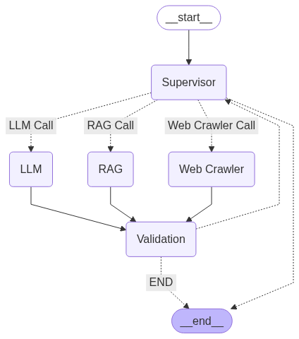

# Prudence Jury Assistant

An AI-powered assistant designed to help with jurisprudence-related question answering tasks, leveraging RAG (Retrieval-Augmented Generation) and web search capabilities.

## Features

- **Jurisprudence Question Answering**: Specialized in answering legal questions using retrieved documents
- **Multi-source Information Retrieval**:
  - Local document RAG system
  - Web search capabilities
  - General knowledge LLM fallback
- **Intelligent Routing**: Automatically routes questions to the most appropriate information source
- **Validation System**: Ensures quality and relevance of responses

## Technology Stack

- **Language Model**: Groq's Gemma2-9b-it
- **Embeddings**: BAAI/bge-small-en from Hugging Face
- **Vector Database**: FAISS for local document storage
- **Web Search**: Tavily Search API
- **Framework**: LangGraph for workflow orchestration
- **Validation**: Pydantic models for structured output

## Installation

1. Clone the repository:
   ```bash
   git clone [repository-url]
   cd prudence-jury-assistant
Set up environment variables:

Create a .env file with the following:

GROQ_API_KEY=your_groq_api_key
HF_TOKEN=your_huggingface_token
TAVILY_API_KEY=your_tavily_api_key
Install dependencies:

pip install -r requirements.txt
Usage
Place any PDF documents in the data_Prudence directory


Requirements
See requirements.txt for full list, key packages include:

langchain

langgraph

pydantic

faiss-cpu

huggingface-hub

langchain-groq

tavily-python


Run the assistant:

python
from assistant import app


Workflow Diagram


